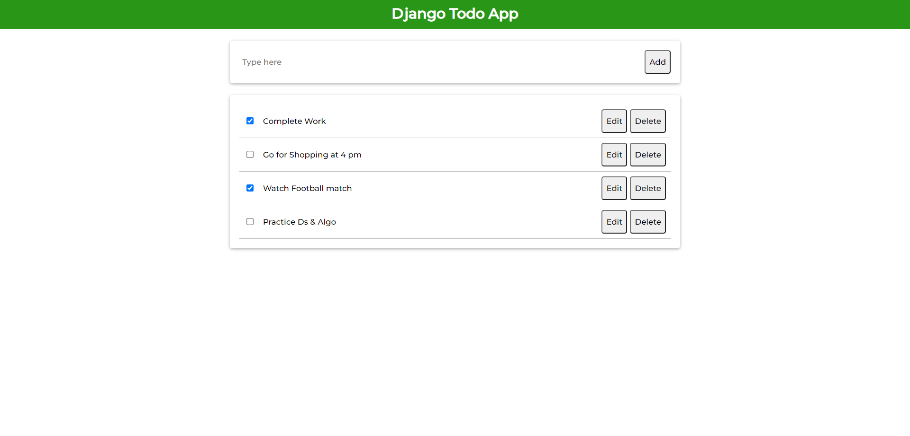

# django-todo-app

## Setup

The first thing to do is to clone the repository:

```sh
$ git clone https://github.com/Siddhesh8220/django-todo-app.git
$ cd django-todo-app
```

Create a virtual environment to install dependencies in and activate it:

```sh
$ virtualenv2 --no-site-packages env
$ source env/bin/activate
```

Then install the dependencies:

```sh
(env)$ pip install -r requirements.txt
```
Note the `(env)` in front of the prompt. This indicates that this terminal
session operates in a virtual environment set up by `virtualenv2`.

Once `pip` has finished downloading the dependencies:
```sh
(env)$ cd project
(env)$ python manage.py runserver
```
And navigate to `http://127.0.0.1:8000`.

1. Fetch data on load



2. Add Todo


3. Delete Todo


4. Edit Todo


